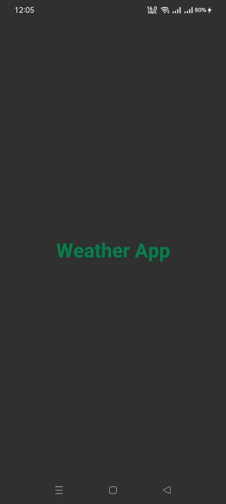

## Weather App

It gets weather information from [Open Weather API](https://openweathermap.org/current).  
Using a periodic work manager this app
will also notify current temperature of your location every 1 hour.
##### Tools I have used,
* Android SDK
* Kotlin
* Constraint Layout
* View Binding & Data Binding
* Navigation components
* Deep Links
* Kotlin Coroutines
* Retrofit
* Hilt
* Work Manager
* MVVM
## Download
Try the debug build of
**[Weather App](https://github.com/SrizanX/weather_app/raw/main/apk/app-debug.apk)**
## Screenshots

#### Splash Screen
Created using [Splash Screen API](https://developer.android.com/guide/topics/ui/splash-screen).

#### Home Screen

 
   

#### Weather Details

   

#### Landscape mode
   

 

### No Internet & Notification Screen

 
 

